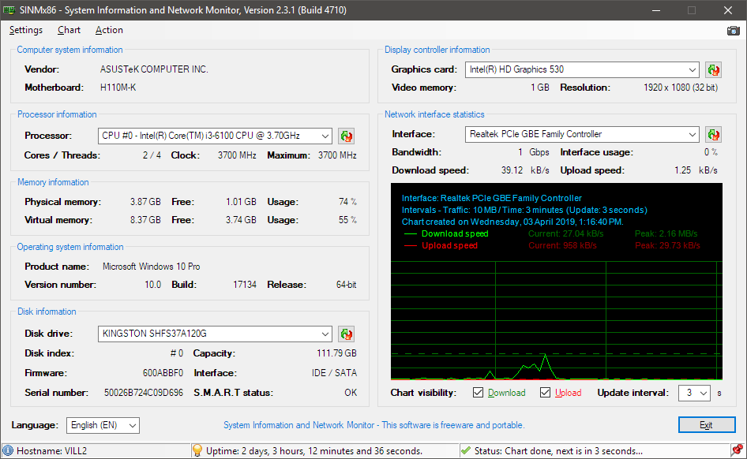

# SINMx86 - System Information and Network Monitor

A simple system information and real-time network monitoring utility.\
This utility reads all system information directly from WMI database.

## Current stable version:

SINMx86 v2.3.1 Build 4710 (2018-03-25)

### Supported languages:

English, Hungarian

### Compilation environment:

Microsoft Visual Basic 2013 (Community, Update 5)

### Source author:
Gábor Deé

### License:

GNU/GPL 2.0

## Screenshot

## Changelog since version 2.1.0 (Hungarian only)

### 2019-03-25 - Version 2.3.1 / Build 4710 (stable)
- Tabstop indexek javítva,
- Főablak megjelenés korrigálása (lenyíló listák egységesítve, boxok helyzete fixálva).

### 2019-03-24 - Version 2.3.0 / Build 4700 (stable)
- Lokalizált dátum és idő generálás a diagramon,
- Videokártya lenyíló lista (több VGA-t is kezel),
- Videomemória tizedes elválasztó javítása,
- Hibás registry értékek visszaírásának megakadályozása,
- Főablak lekérdezések egyszerűsítése (közvetlen helyett függvénybe ültetve),
- Előre kiválasztott interfész eltüntetése a registry-ből,
- Alapértelmezett diagram frissítés visszaállítása 3 másodpercre,
- 0 bájtos lemezméret javítása (nincs lemez),
- Processzor lenyíló lista (debuggolva kétprocesszoros rendszeren),
- Windows XP Splash ablak tiltása, a menükből is,
- Windows XP kompatibilitás javítása: nem létező WMI értékek lekérésének tiltása,
- WMI lekérdezése egyszerűsítése (csak a kezelt értékek kerülnek lekérdezésre),
- Főablak megjelenés korrigálása,
- Fordítások javítása.

### 2019-03-20 - Version 2.2.0 / Build 4500 (stable)
- Videomemória fix MB helyett aktuális helyiértékben,
- Rendszerinformációk helyett az alaplap azonosítóinak kiolvasása,
- Lemezek sorszám szerinti rendezése,
- SMART infó és szektorméret nem kell,
- Rendszermemória fix MB helyett aktuális helyiértékben,
- Teljes screenshot mentésének lehetősége a ablakról (fotó ikon a jobb felső sarokban),
- Windows 7 lemez szériaszám korrekció,
- Rendszermemória tizedes elválasztó hiba javítva.

### Copyright (C) 2019 dtech(.hu)
