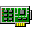
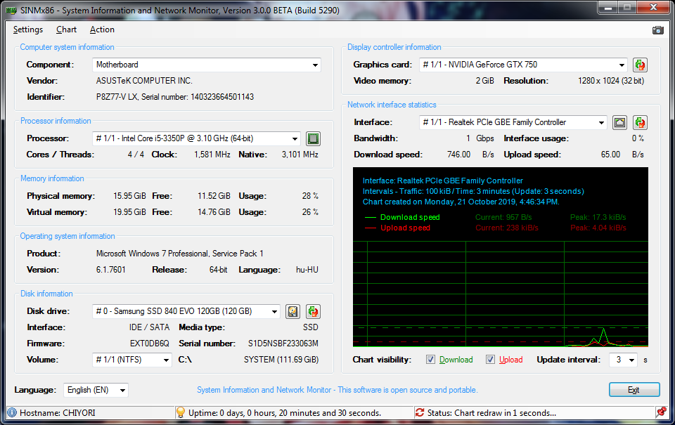

# SINMx86 
### System Information and Network Monitor

A simple system information and real-time network monitoring utility.\
This utility reads all system information directly from WMI database.

## Current stable version: 3.0.3 Build 5421 (2021-05-20)

## Developement information

__Supported languages:__ English, Hungarian,\
__Compilation environment:__ Microsoft Visual Basic 2013 (Community, Update 5),\
__Source author:__ Gábor Deé (dtech),\
__License:__ GNU General Public License v2.0,\
__Supported operating systems:__ Microsoft Windows 2000 SP4, XP SP3, Server 2003/XP x64 SP2, Vista, 7, 8, 8.1, 10,\
__Requirements:__ Microsoft .NET Framework 3.5 (Minimum required: 2.0 SP2).

## Screenshot

## Changelog since version 2.1.0 (Hungarian only)

__2021-05-20 - Version 3.0.3 / Build 5421 (stable)__

- Intel SATA SSD-k detektálása javítva.

__2019-12-05 - Version 3.0.2 / Build 5420 (stable)__

- Hiányzó processzor név patch lekezelésének javítása (Windows 2000),
- Átlagsebesség megjelenítése a diagramon a jelenlegi sebesség helyett,
- S.M.A.R.T értékek korrekciója: üzemórák konverziójának javítása.

__2019-11-27 - Version 3.0.1 / Build 5410 (stable)__

- Cellaszélesség beállítása az infó ablakokban, a gördítősáv figyelembevételével,
- Ablak eltűnésének javítása a második példány indításakor (Windows 10),
- Aktuális órajel eltűntetése a CPU-infó ablakból (nem frissül és nincs is jelentősége),

__2019-11-25 - Version 3.0.0 / Build 5400 (stable)__

- Windows XP hiányzó processzor név patch lekezelése (KB953955),
- Zárójeles sztringek eltávolításának lehetősége új függvénnyel,
- Operációs rendszer információk módosítása, Windows 10 verzió kiírásának hozzáadása,
- A kiírásokat javító függvények paramétereinek tisztítása,
- Nem támogatott felbontás hiba megjelenítése 1024x768-asnál kisebb felbontás esetén,
- Taskbar ikon menüjének letiltása indítás közben,
- Windows XP hiányzó HT/Multicore patch lekezelése (KB936235),
- Lemezek független hőfok figyelmeztetése (figyelmeztetés: 45 fok, kritikus 55 fok),
- Figyelmeztető S.M.A.R.T rekordok bevezetése: nem kritikus, de veszélyt jelentő rekordok,
- Ténylegesen kritikus S.M.A.R.T rekordok beállítása figyelmeztetésre,
- Memória infó blokk újraírása, memória infó ablak hozzáadása,
- Főablak blokkok átrendezése: minden hardver információ bal oldalra került,
- Újbóli indítási kísérlétnél üzenet megjelenítése (csak egy példány futhat),
- Negatív futásidő hiba kiküszöbölése, DateTime konverziós függvény eltávolítása,
- Operációs rendszer függő hálózati kártya nevek és indexek kezelése,
- Wildcard lekérdezések megszűntetése, OS függő lekérdezések függetlenítése,
- CPU magok és szálak frissítésének tiltása (terhelés csökkentés),
- Kiválasztott lemezmeghajtó meglétének ellenőrzése külön függvény által,
- CPU-Infó lekérés gyorsítása: wildcard helyett a lekért paraméterekkel,
- S.M.A.R.T értékek kiértékelése, kritikus értékek kiemelése,
- Hálózati információs gomb: folyamatos csatlakozás ellenőrzése,
- Letiltott vagy eltávolított hálózati interfész lekezelése,
- Menet közben eltávolított meghajtó hibájának lekezelése lekéréskor,
- Hiba- és állapotkezelő rendszer létrehozása betöltődéskor,
- Szelektív S.M.A.R.T rekord kezelés, adathordozó típus függvényében,
- CPU-Infó: Gyártói sztringek lecserélése a valódi névre,
- Listákban szereplő nevek rövidítése egyes felesleges karakterekkel,
- Celsius/Fahrenheit átszámítás a lemez hőmérsékletnél,
- Közös függvények és változók leválasztása főablakról (Functions.vb),
- SI és bináris prefixum korrekció, kibi (ki): 1024/kilo (k): 1000,
- Nagyságrend (1000-es) elválasztó hozzáadása hosszú számoknál,
- Kód tisztítása, néhány konverziós függvény átértelmezése,
- Hibakezelések javítása számos összetevőt illetően,
- Nyelvi interfész teljes újraírása, külön fájlba implementálva,
- Hálózati információk megjelenítése a kiválasztott adatperhez,
- Hálózati kártyák nevének lekérdezése a NetworkAdapater helyről a PnPEntity helyett,
- Részletes processzor információk megjelenítése,
- S.M.A.R.T értékek lekérdezése belső IDE/SATA lemezeknél,
- Kiesett idő miatti timer hibák kezelése (készenlét, óraszinkron, stb.),
- Rendszerindítás óta eltelt idő számításának újraimplementálása,
- SSD/HDD felismerés hozzáadása (S.M.A.R.T rekord alapján).

__2019-09-18 - Version 2.5.1 / Build 5010 (stable)__

- Feketelistás OEM sztringek tömbösített keresése a komponens információkban,
- Buboréküzenet hiba javítása kis méretre alakítás esetén,
- Lista ToolTip-ek cseréje: magyarázat helyett a teljes kiválasztás nevének kiírása,
- Frissítési link javítása, már a legfrisebb stabil kiadásra mutat.

__2019-05-29 - Version 2.5.0 / Build 5000 (stable)__

- Komponenslista az alaplap információi helyett (számítógép és BIOS is),
- Szövegkiírások pozíciójának egységesítése, diagram méretének növelése,
- Diagram leképezés javítása a referenciaértékekhez (dinamikus képméret korrekció),
- Felesleges sztring -> sztring korrekciók eltávolítása,
- Lemezek nevének rövidítése (SCSI/ATA/USB jelölések eltávolítása),
- ISATAP adapterek kihagyása az interfészlistából,
- Szring formázó függvény javítása (üres sztring és kezdőszóköz eltávolítás javítva),
- SMART állapot eltávolítása (a WMI által adott információk sok esetben irrelevánsak),
- Külön mező helyett a lemez indexek feltüntetése a lemezlistában,
- Partíciós lista és kötetinformációk megjelenítése az adott lemeznél,
- Reset címke beállítása a listafrissítő függvényeknél,
- Névkorrekció helyett a hálózati kártya nevek kinyerése a PnP azonosítóból,
- Operációs rendszer információk kiírásának átalakítása,
- Akkumulátor információk hozzáadása a hardverlistához,
- Érvénytelen karakterek szűrésének hozzáadása,
- Windows XP UInt32 visszaállítása a forgalom lekérdezésénél (NT6 felett Uint64),
- Processzorlista frissítési gomb eltávolítása,
- Hálózati kártya nélküli gépek lekezelése,
- Diagram menüjének és mentésének visszaállítása,
- Listakezelés: sorszámok hozzáadása (processzor, videokártya, hálózati kártya).

__2019-04-09 - Version 2.3.2 / Build 4725 (stable)__

- Forráskódok közzététele az oldalon és GitHub-on is,
- Diagram mentési lehetőség és diagram menü kikapcsolása,
- Splash ablak TopMost kikapcsolása névjegynél, automatikus bezárás tálcára tételkor,
- Mentett screenshot megnyitása a buborékra kattintáskor.

__2019-03-25 - Version 2.3.1 / Build 4710 (stable)__

- Tabstop indexek javítva,
- Főablak megjelenés korrigálása (lenyíló listák egységesítve, boxok helyzete fixálva).

__2019-03-24 - Version 2.3.0 / Build 4700 (stable)__

- Lokalizált dátum és idő generálás a diagramon,
- Videokártya lenyíló lista (több VGA-t is kezel),
- Videomemória tizedes elválasztó javítása,
- Hibás registry értékek visszaírásának megakadályozása,
- Főablak lekérdezések egyszerűsítése (közvetlen helyett függvénybe ültetve),
- Előre kiválasztott interfész eltüntetése a registry-ből,
- Alapértelmezett diagram frissítés visszaállítása 3 másodpercre,
- 0 bájtos lemezméret javítása (nincs lemez),
- Processzor lenyíló lista (debuggolva kétprocesszoros rendszeren),
- Windows XP Splash ablak tiltása, a menükből is,
- Windows XP kompatibilitás javítása: nem létező WMI értékek lekérésének tiltása,
- WMI lekérdezése egyszerűsítése (csak a kezelt értékek kerülnek lekérdezésre),
- Főablak megjelenés korrigálása,
- Fordítások javítása.

__2019-03-20 - Version 2.2.0 / Build 4500 (stable)__

- Videomemória fix MB helyett aktuális helyiértékben,
- Rendszerinformációk helyett az alaplap azonosítóinak kiolvasása,
- Lemezek index szerinti rendezése, növekvő sorrendben,
- A szektorméret helyett lemez sorozatszámának kiírása (kiírási sorrend átrendezve),
- Rendszermemória fix MB helyett aktuális helyiértékben,
- Teljes screenshot mentésének lehetősége az ablakról (fotó ikon a jobb felső sarokban),
- Windows 7 lemez szériaszám korrekció (hexadecimális visszaalakítás és bájtsorrend csere),
- Rendszermemória tizedes elválasztó hiba javítva.

__Copyright (C) 2021 dtech(.hu), [http://sinmx86.dtech.hu/](http://sinmx86.dtech.hu/).__
