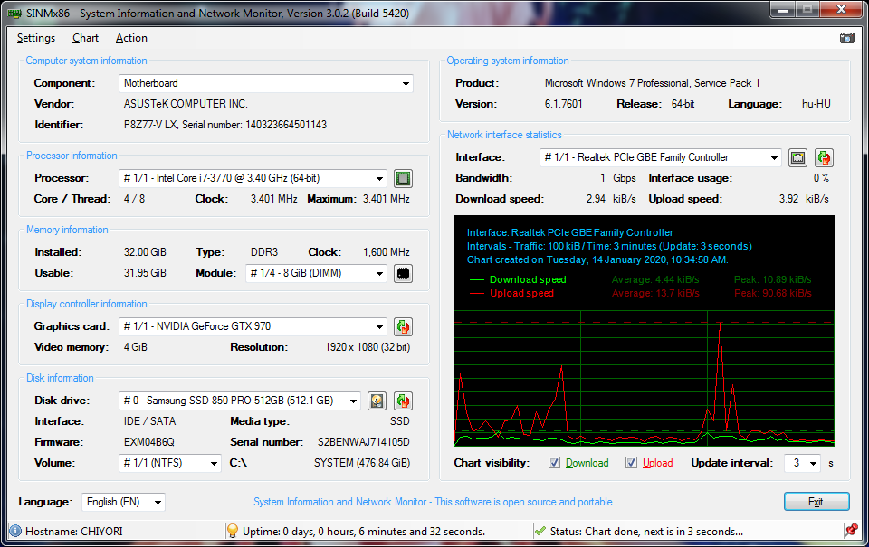

# SINMx86 
### System Information and Network Monitor

A simple system information and real-time network monitoring utility.\
This utility reads all system information directly from WMI database.

## Current stable version: 2.5.1 Build 5010 (2019-09-18)

## Developement information

__Supported languages:__ English, Hungarian,\
__Compilation environment:__ Microsoft Visual Basic 2013 (Community, Update 5),\
__Source author:__ Gábor Deé (dtech),\
__License:__ GNU General Public License v2.0.

## Screenshot

## Changelog since version 2.1.0 (Hungarian only)

__2019-09-18 - Version 2.5.1 / Build 5010 (stable)__

- Feketelistás OEM sztringek tömbösített keresése a komponens információkban,
- Buboréküzenet hiba javítása kis méretre alakítás esetén,
- Lista ToolTip-ek cseréje: magyarázat helyett a teljes kiválasztás nevének kiírása,
- Frissítési link javítása, már a legfrisebb stabil kiadásra mutat.

__2019-05-29 - Version 2.5.0 / Build 5000 (stable)__

- Komponenslista az alaplap információi helyett (számítógép és BIOS is),
- Szövegkiírások pozíciójának egységesítése, diagram méretének növelése,
- Diagram leképezés javítása a referenciaértékekhez (dinamikus képméret korrekció),
- Felesleges sztring -> sztring korrekciók eltávolítása,
- Lemezek nevének rövidítése (SCSI/ATA/USB jelölések eltávolítása),
- ISATAP adapterek kihagyása az interfészlistából,
- Szring formázó függvény javítása (üres sztring és kezdőszóköz eltávolítás javítva),
- SMART állapot eltávolítása (a WMI által adott információk sok esetben irrelevánsak),
- Külön mező helyett a lemez indexek feltüntetése a lemezlistában,
- Partíciós lista és kötetinformációk megjelenítése az adott lemeznél,
- Reset címke beállítása a listafrissítő függvényeknél,
- Névkorrekció helyett a hálózati kártya nevek kinyerése a PnP azonosítóból,
- Operációs rendszer információk kiírásának átalakítása,
- Akkumulátor információk hozzáadása a hardverlistához,
- Érvénytelen karakterek szűrésének hozzáadása,
- Windows XP UInt32 visszaállítása a forgalom lekérdezésénél (NT6 felett Uint64),
- Processzorlista frissítési gomb eltávolítása,
- Hálózati kártya nélküli gépek lekezelése,
- Diagram menüjének és mentésének visszaállítása,
- Listakezelés: sorszámok hozzáadása (processzor, videokártya, hálózati kártya).

__2019-04-09 - Version 2.3.2 / Build 4725 (stable)__

- Forráskódok közzététele az oldalon és GitHub-on is,
- Diagram mentési lehetőség és diagram menü kikapcsolása,
- Splash ablak TopMost kikapcsolása névjegynél, automatikus bezárás tálcára tételkor,
- Mentett screenshot megnyitása a buborékra kattintáskor.

__2019-03-25 - Version 2.3.1 / Build 4710 (stable)__

- Tabstop indexek javítva,
- Főablak megjelenés korrigálása (lenyíló listák egységesítve, boxok helyzete fixálva).

__2019-03-24 - Version 2.3.0 / Build 4700 (stable)__

- Lokalizált dátum és idő generálás a diagramon,
- Videokártya lenyíló lista (több VGA-t is kezel),
- Videomemória tizedes elválasztó javítása,
- Hibás registry értékek visszaírásának megakadályozása,
- Főablak lekérdezések egyszerűsítése (közvetlen helyett függvénybe ültetve),
- Előre kiválasztott interfész eltüntetése a registry-ből,
- Alapértelmezett diagram frissítés visszaállítása 3 másodpercre,
- 0 bájtos lemezméret javítása (nincs lemez),
- Processzor lenyíló lista (debuggolva kétprocesszoros rendszeren),
- Windows XP Splash ablak tiltása, a menükből is,
- Windows XP kompatibilitás javítása: nem létező WMI értékek lekérésének tiltása,
- WMI lekérdezése egyszerűsítése (csak a kezelt értékek kerülnek lekérdezésre),
- Főablak megjelenés korrigálása,
- Fordítások javítása.

__2019-03-20 - Version 2.2.0 / Build 4500 (stable)__

- Videomemória fix MB helyett aktuális helyiértékben,
- Rendszerinformációk helyett az alaplap azonosítóinak kiolvasása,
- Lemezek index szerinti rendezése, növekvő sorrendben,
- A szektorméret helyett lemez sorozatszámának kiírása (kiírási sorrend átrendezve),
- Rendszermemória fix MB helyett aktuális helyiértékben,
- Teljes screenshot mentésének lehetősége az ablakról (fotó ikon a jobb felső sarokban),
- Windows 7 lemez szériaszám korrekció (hexadecimális visszaalakítás és bájtsorrend csere),
- Rendszermemória tizedes elválasztó hiba javítva.

__Copyright (C) 2019 dtech(.hu), [http://sinmx86.dtech.hu/](http://sinmx86.dtech.hu/).__
